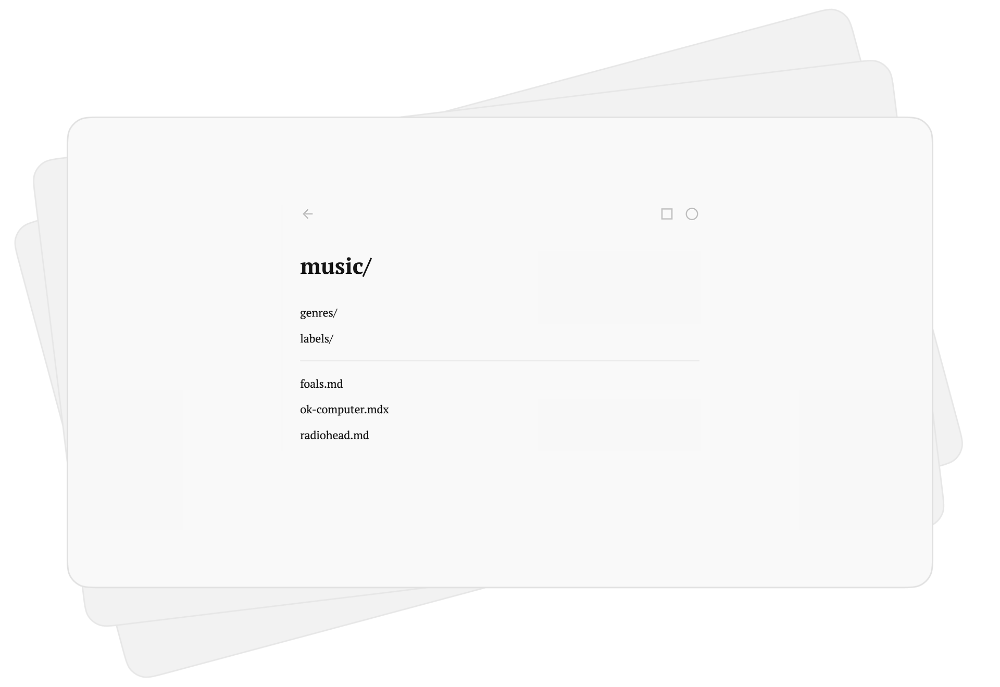
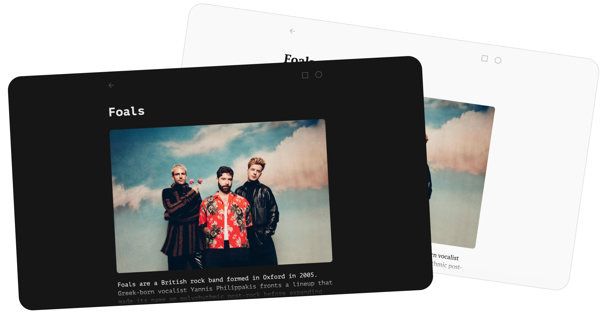

# notes.

 

Tiny [Astro](https://astro.build) site that turns a folder of files into your personal notes storage. Inspired by [type.](https://type.baby) [Get started →](#get-started)

[](https://notes.qurle.net)

## How it works

### Drop a file, get a page
No config, no database, no admin panel. Put a `.md` `.mdx` `.astro` or `.html` file into `src/pages/` — and it's published. That's it. That's the whole workflow.

### Folders are pages too
Nest your notes however your brain likes. Every folder becomes a navigable listing, generated automatically. Two notes or two hundred — the structure just follows you.

```
src/pages/
├── films/
│   ├── blade-runner.md
│   ├── 2001.mdx
│   └── directors/
│       └── lynch.md
└── personal/
    ├── setup.md
    └── notes/
        └── coffee.astro
```

### Any content you like
Markdown and MDX are styled automatically, zero extra steps. Astro pages get the same look — just wrap them in `NoteLayout`:

```astro
---
import NoteLayout from '@layouts/NoteLayout.astro'
---
<NoteLayout>your content</NoteLayout>
```

HTML pages are listed and served as-is, no styling applied. Raw and proud.

### Frameworks included
Components run right inside notes: 
1. Drop a `.tsx` `.vue` `.svelte` or `astro` file into `src/components/`
2. Import and use it in any `.mdx` or `.astro` note 
3. Add [`client:load`](https://docs.astro.build/en/reference/directives-reference/#clientload) directive for interactive components

```mdx
import Counter from '@components/Counter'

# I can count!
<Counter client:load />
```

## How it feels

### Hands on keyboard
Browse like it's a file manager. Arrow keys move between entries, Backspace takes you back. Mouse is optional, honestly.

### Pick the right style
Switch fonts (serif / mono / sans) and themes (light / dark / digital) to find the look that feels like home. Your choice is remembered.




## Build your own notes

### Get started
1. Install [Node](https://nodejs.org) (cause you need npm)
2. Download repository
3. Open terminal and run this
```bash
cd <path to folder of notes.>
npm i
npm run dev
```
4. Open link from terminal (usually http://localhost:4321/)

That's it. Replace `src/pages` content with your own notes and you are ready for deploy.

### Make it yours
Completely optional configuration lives in one file — [`notes.settings.jsonc`](https://github.com/qurle/notes/blob/main/notes.settings.jsonc) in the project root. No admin panel.

| Setting | What it does |
| --- | --- |
| `rootTitle` | The main heading on the root page of your site |
| `title` | Your site's name — the browser tab and the title suffix |
| `description` | Default page description, for meta tags and link previews |
| `appearance` | Starting `theme` / `font` and whether their switcher buttons show |
| `indexable` | `false` tags every page `noindex` so search engines skip it — flip to `true` to go public |
| `footer` | Show / hide the footer and set its links |

**One privacy caveat:** `indexable` only hides you from search — everything in `src/pages/` is still served to anyone who has the link. Keep truly private things out of the repo.

If you want to edit styles, welcome to `src/styles/`. Folder page logic lives in `src/pages/[...folder].astro`.

---
Designed and developed by [qurle](https://qurle.net). Inspired by [type.baby](https://type.baby).

Share bugs and ideas via [issues](https://github.com/qurle/notes/issues). Any dialogs are also welcome at [nick@qurle.net](mailto:nick@qurle.net?subject=notes.).
